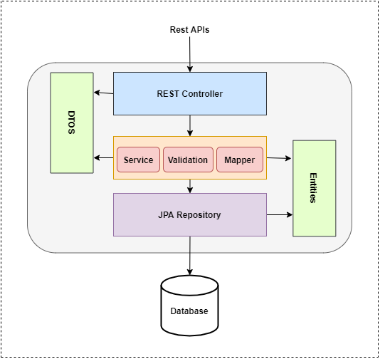
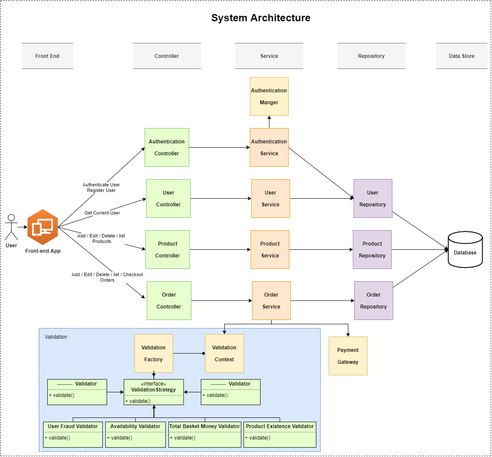
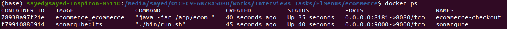

# E-commerce checkout process
Design and implement the e-commerce order basket checkout process.

## Table of contents
* [Requirements](#requirements)
* [Architecture](#architecture)
* [Technologies](#technologies)
* [Getting Started](#getting-started)
* [Running the application using Docker and Docker Compose](#running-the-application-using-docker-and-docker-compose)
* [Running the application for Development using Maven](#running-the-application-for-development-using-maven)
* [About me](#about-me)
* [Acknowledgments](#acknowledgments)

## Requirements
Implement the order basket checkout process:

- Order has items and every item has an availability flag to show the item availability and price field.
- Before checkout we need to do the following steps:
  - Validate the basket items availability.
  - Validate with the total basket money value above 100
  - Check if the user is fraud or not by assuming that the fraud user's order basket has more than 1500 money value.
  - Integrate with a credit card payment tool to deduct the money from the customer credit card.
- Implement the API to checkout using rest.

- Add tests (Unit Test & Integration Test) .
- This project will scale and more validation rules will be added in addition to more complex fraud detection policies.


## Architecture
The next diagrams shows the system architecture:





The **REST architectural** architecture. The outside world calls the **REST Apis (Controller)**, which interacts with the **Service**. Service calls the **repository**. The repository interacts with the database.

###  Validation Using the Strategy and Factory Design Patterns
For the validation rules policies to be scaled and added dynamically I implemented it using **Strategy Pattern with Factory Pattern**
- **Strategy Pattern**:
 It is used to switch between family of algorithms.
The strategy pattern lets us select the correct validation behavior at runtime. Each Strategy class is responsible for one type of validation. 

- **Factory Pattern**:
The factory pattern is used for creating new objects.  We can use this to determine which strategies objects gets returned based on the operation (domain).

- The **Validation Context** accepts set of validation strategies from **Validation Factory** and uses those strategies for the execution.

## Technologies

1. Java 11
2. Spring Boot

	+ Web
	+ Data JPA
	+ validation
	+ test
	+ Actuator
3. Lombok
4. Maven Dependency Management
5. Stripe Payment Gateway
6. Swagger 2
7. Sonarqube
8. Docker


## Getting Started

### Running the application using Docker and Docker Compose
The project includes [*Dockerfile*](Dockerfile) file and [*docker-compose.yml*](../docker-compose.yml) file, so you can use `Docker Compose` to start up the application with required softwares. No installation needed.

#### Prerequisites
You need to install:
* [Docker](https://docs.docker.com/engine/install/) 
* [Docker-compose](https://docs.docker.com/compose/install/)

#### Clone the project
Clone the project from `github` using the following `git` command at console:

```bash
git clone https://github.com/SayedBaladoh/ecommerce.git
```
#### Change application configurations
- You need to add the required configuration for the application: 
  - open `src/main/resources/application.properties` file.
  - Change:
    - 'STRIPE_SECRET_KEY' The Stripe payment test secret key.
    - `BASE_URL`: The base url for successURL and failedURL for payment gateway
  - You can change other settings like server port, database username and password.

#### Run the project
- You can start the project using the below `docker-compose` command in the console at the project root directory:
 
```bash
cd ecommerce/

docker-compose up
```

- Run without display logs:

```bash
docker-compose up -d
```

- In case of any changes, rebuild the image:

```bash
docker-compose up -d --build
```

- In the end, you can **verify** whether the project was started by running in the console:

```bash
docker ps
```

You should see the following running containers:




Sonarqube, and Ecommerce checkout are UP and RUNNING

#### Access the REST APIs

The application will start on port `8181`, So you'll be able to access it under address `http://localhost:8181`.
	
- To view `details` about the backend application: [http://localhost:8181/ecommerce/api/actuator/info](http://localhost:8181/ecommerce/api/actuator/info)
- For `Check Health`: [http://localhost:8181/ecommerce/api/actuator/health](http://localhost:8181/ecommerce/api/actuator/health)
- To access `Swagger` documentation to view the available restful end-points, how to use and test APIs: [http://localhost:8181/ecommerce/api/swagger-ui.html](http://localhost:8181/ecommerce/api/swagger-ui.html)


### Running the application for Development using Maven

These instructions will get you a copy of the application up and running on your local machine for development and testing purposes. See deployment for notes on how to deploy the project on a live system.

#### Prerequisites

You need to install the following software:

 * Java 11+
 * Maven 3.0+

#### Installing

Steps to Setup the project:

1. **Clone the application**

```bash
git clone https://github.com/SayedBaladoh/ecommerce.git

cd ecommerce/
```

2. **Change application configurations**
 You need to add the required configuration for the application: 
  - open `src/main/resources/application.properties` file.
  - Change:
    - `STRIPE_SECRET_KEY`: The Stripe payment test secret key.
        - `BASE_URL`: The base url for successURL and failedURL for payment gateway.
  - You can change other settings like server port, database username and password.
	

3. **Run the tests**

	You can run the automated tests by typing the following command:

	```bash
	mvn clean
	mvn test
	```
4.  **Generate Code coverage Analysis Report with Jacoco and Sonarqube**

	Type the following command on the command line with path to the root of this project:

	```bash
	mvn clean install sonar:sonar 
	```

	Wait until build process has finished.

	After getting a Build Success message, There are two link for you to open sonarqube on browser. click that link and automatically open your browser.
	
	Or go to `http://localhost:9000/` on the Web Browser and Click on the Project Name to see the detailed report.
	
5. **Run the application**

	You can run the spring boot application by typing the following command:

	```bash
	mvn spring-boot:run
	```

	The server will start on port `8080` by default, So you'll be able to access the complete application on `http://localhost:8080`. 
	If you changed the port in  `src/main/resources/application.properties` file, use your custom port `http://localhost:port`.

6. **Package the application**

	You can also package the application in the form of a `jar` file and then run it:

	```bash
	mvn clean package
	java -jar target/ecommerce-0.0.1-SNAPSHOT.jar
	```

#### Access the REST APIs

To access the APIs use the following end-points:

- **Metrics to monitor the application**

	+ View availble metrics `http://localhost:8080/ecommerce/api/actuator/`

	+ View application info `http://localhost:8080/ecommerce/api/actuator/info`
	
	+ Health check `http://localhost:8080/ecommerce/api/actuator/health`

- **REST APIs Documentation: Swagger UI**

	Use Swagger to view and test the available Restful end-points.

	+ `http://localhost:8080/ecommerce/api/swagger-ui.html`

## About me

I am Sayed Baladoh - Phd. Senior / Technical Lead Software Engineer. I like software development. You can contact me via:

* [LinkedIn](https://www.linkedin.com/in/SayedBaladoh/)
* [Mail](mailto:sayedbaladoh@yahoo.com)
* [Phone +20 1004337924](tel:+201004337924)

_**Any improvement or comment about the project is always welcome! As well as others shared their code publicly I want to share mine! Thanks!**_

## Acknowledgments

Thanks for reading. Share it with someone you think it might be helpful.
